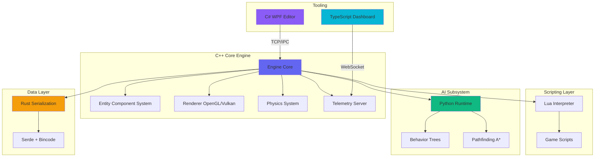

# PrimeFlux Engine Architecture

## Overview

PrimeFlux is a multi-language game engine demonstrating advanced systems programming and cross-language interoperability.

## Architecture Diagram

## Component Responsibilities

### C++ Core Engine
- **Role**: Host application and runtime orchestrator
- **Responsibilities**:
  - ECS management
  - Rendering pipeline
  - Physics simulation
  - Subsystem coordination
  - Telemetry broadcasting

### Rust Serialization
- **Role**: High-performance data persistence
- **Responsibilities**:
  - Scene serialization/deserialization
  - Asset packaging
  - Zero-copy data loading
  - C ABI for C++ integration

### Lua Scripting
- **Role**: Gameplay logic
- **Responsibilities**:
  - Entity behaviors
  - Game rules
  - Hot-reloadable scripts
  - Event handling

### Python AI
- **Role**: Intelligent agent behaviors
- **Responsibilities**:
  - Behavior tree execution
  - Pathfinding algorithms
  - ML-based decision making
  - NPC controllers

### C# Editor
- **Role**: Content creation tool
- **Responsibilities**:
  - Scene authoring
  - Entity inspection
  - Component editing
  - Asset import

### TypeScript Dashboard
- **Role**: Real-time monitoring
- **Responsibilities**:
  - Performance metrics
  - System telemetry
  - Remote debugging
  - Log aggregation

## Data Flow

1. **Scene Loading**: C++ → Rust (deserialize) → ECS
2. **Gameplay**: ECS → Lua (script execution) → ECS updates
3. **AI Decisions**: ECS → Python (behavior tree) → ECS updates
4. **Rendering**: ECS → Renderer → GPU
5. **Telemetry**: Engine → WebSocket → Dashboard
6. **Editing**: Editor → TCP → Engine (live updates)

## Interop Mechanisms

| From | To | Method |
|------|-----|--------|
| C++ | Rust | C ABI (extern "C") |
| C++ | Lua | Embedded interpreter |
| C++ | Python | pybind11 or C API |
| C++ | Dashboard | WebSocket |
| Editor | C++ | TCP/IPC |

## Performance Considerations

- **Hot Path**: C++ (ECS, Rendering, Physics)
- **Warm Path**: Lua (Gameplay logic)
- **Cold Path**: Python (AI decisions), Rust (Serialization)
- **Async**: Dashboard telemetry, Editor communication

## Future Enhancements

- Multi-threaded job system for ECS
- Vulkan rendering backend
- ML model integration for AI
- Distributed scene editing
- Asset streaming pipeline
