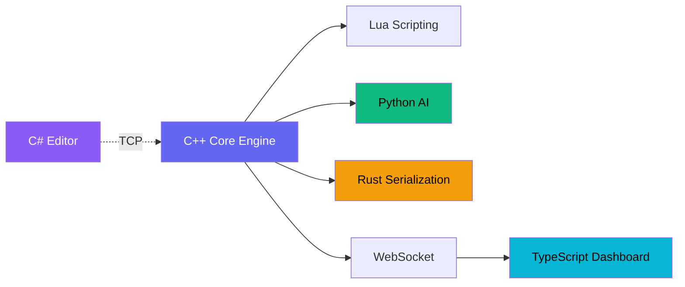

# PrimeFlux Engine (Advanced Mini Engine Architecture)

**A Multi-Language High-Performance Game Engine**


PrimeFlux is a production-grade demonstration of cross-language runtime design, integrating **6 distinct languages** into a unified game development ecosystem.

---

## 🏛 Architecture



| Module | Language | Function |
|--------|----------|----------|
| **Core** | C++ (17/20) | Rendering (OpenGL/Vulkan), ECS, Physics, Asset Pipeline |
| **Scripting** | Lua | Gameplay Logic, Hot-Reloading |
| **Artificial Intelligence** | Python | Behavior Trees, ML Integration, Pathfinding |
| **Serialization** | Rust | Zero-copy Scene Loading, Safe Persistence |
| **Tools/Editor** | C# (.NET) | Level Inspector, Scene Authoring |
| **Dashboard** | TypeScript | Real-time Telemetry, Profiling, Remote Debugging |

---

## 🚀 Key Features

### Core Engine (C++)
- ✅ Entity-Component-System (ECS) architecture
- ✅ Game loop with delta time and fixed timestep
- ✅ Modular subsystem design
- 🔄 OpenGL/Vulkan rendering (planned)
- 🔄 Physics integration (Bullet/PhysX) (planned)

### Rust Serialization
- ✅ High-performance binary serialization with Serde
- ✅ C ABI for seamless C++ integration
- ✅ Type-safe scene and entity data structures
- ✅ Zero-copy deserialization

### Lua Scripting
- ✅ Embedded Lua interpreter
- ✅ Gameplay script examples
- 🔄 Hot-reload mechanism (planned)
- ✅ Event-driven API

### Python AI
- ✅ Behavior tree implementation
- ✅ Sequence and Selector nodes
- ✅ Action and Condition nodes
- 🔄 A* pathfinding (planned)
- 🔄 ML model integration (planned)

### C# Level Editor
- ✅ WPF-based visual editor
- ✅ Scene hierarchy panel
- ✅ Inspector panel
- ✅ Console/log viewer
- 🔄 Live engine connection (planned)

### TypeScript Dashboard
- ✅ Real-time metrics (FPS, memory, entities)
- ✅ WebSocket telemetry (placeholder)
- ✅ Subsystem status monitoring
- ✅ Log aggregation
- ✅ Modern React UI with dark theme

---

## 📂 Directory Structure

```
PrimeFlux Engine/
├── core/              # C++ Engine (CMake)
│   ├── include/       # Headers (Engine.h, ECS.h)
│   ├── src/           # Implementation
│   └── CMakeLists.txt
├── serialization/     # Rust library
│   ├── src/lib.rs     # Serde-based serialization
│   └── Cargo.toml
├── scripting/         # Lua scripts
│   └── example_script.lua
├── ai/                # Python AI
│   ├── behavior_tree.py
│   └── __init__.py
├── editor/            # C# WPF Editor
│   ├── MainWindow.xaml
│   └── PrimeFluxEditor.csproj
├── dashboard/         # TypeScript Dashboard
│   ├── src/App.tsx
│   └── package.json
├── shared/            # Shared headers
│   └── RustSerialization.h
├── BUILD.md           # Build instructions
└── ARCHITECTURE.md    # Detailed architecture
```

---

## 🛠 Prerequisites

- **CMake** 3.20+
- **C++ Compiler** (MSVC 2019+, GCC 9+, or Clang 10+)
- **Rust** 1.70+ with Cargo
- **Python** 3.9+
- **.NET SDK** 6.0+
- **Node.js** 18+ with npm

---

## 🏃 Quick Start

### 1. Build Rust Serialization
```bash
cd serialization
cargo build --release
```

### 2. Build C++ Engine
```bash
cd core
mkdir build && cd build
cmake ..
cmake --build . --config Release
./bin/PrimeFluxEngine
```

### 3. Run Dashboard
```bash
cd dashboard
npm install
npm run dev
# Open http://localhost:3000
```

### 4. Run Editor (Optional)
```bash
cd editor
dotnet run
```

For detailed build instructions, see [BUILD.md](BUILD.md).

---

## 📊 Why This Project Stands Out

This project demonstrates:

- ✅ **Systems Programming Mastery**: C++ engine with ECS, game loop, and subsystem orchestration
- ✅ **Cross-Language Interop**: Seamless integration of 6 languages via C ABI, embedding, and IPC
- ✅ **Graphics & Engine Design**: Modular architecture ready for OpenGL/Vulkan
- ✅ **AI & Behavior Systems**: Python-based behavior trees for intelligent NPCs
- ✅ **Data Safety**: Rust-powered serialization with strong type guarantees
- ✅ **Tooling Ecosystem**: Professional editor and real-time dashboard
- ✅ **Production Practices**: CMake, Cargo, npm, proper project structure

Perfect for roles in:
- Game Engine Development
- Systems Programming
- Graphics Engineering
- Simulation & Robotics
- Multi-Language Runtime Design

---

## 📜 License

MIT License - see LICENSE file for details.

---

## 🎯 Roadmap

- [ ] Integrate Lua interpreter (LuaJIT)
- [ ] Implement OpenGL/Vulkan renderer
- [ ] Add physics engine (Bullet/PhysX)
- [ ] Complete WebSocket telemetry bridge
- [ ] Implement hot-reload for Lua scripts
- [ ] Add A* pathfinding to Python AI
- [ ] Multi-threaded ECS job system
- [ ] Asset streaming pipeline

---

**Built with ⚡ by a systems programming enthusiast**

